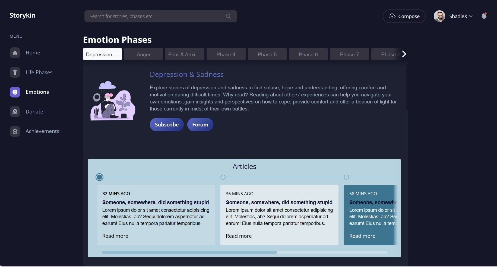
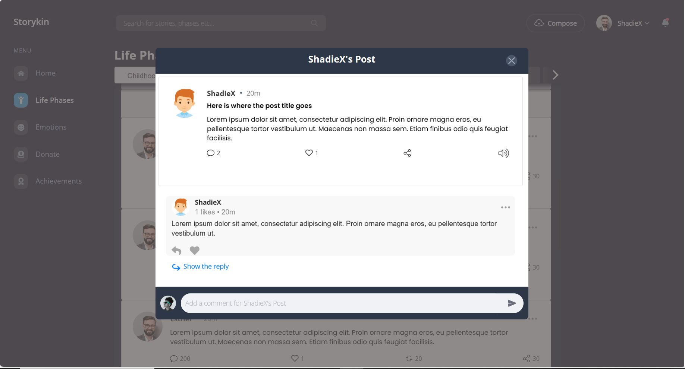
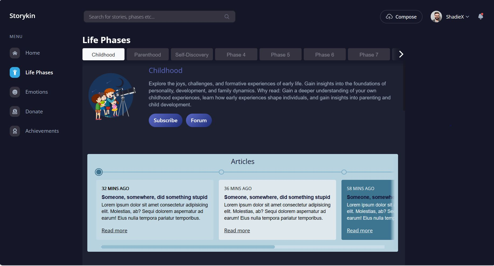

# Storykin
An interactive platform that enables individuals to share their unique experiences across various stages of life and emotional journeys. This platform serves as a learning hub where others can gain insights and wisdom from these shared experiences.

As seen from the above image the experiences are shared under Emotional Phases and Life Phases which adds ease of access. Below are pictures which highlight the network functionality and features. To name a few : 1)Post & comment creation 2)Image editing 3)Account creation and delete etc. If you find this project useful, consider supporting it by buying me a coffee. Paypal: https://www.paypal.com/donate/?hosted_button_id=SK5SEGTHVC53L .

